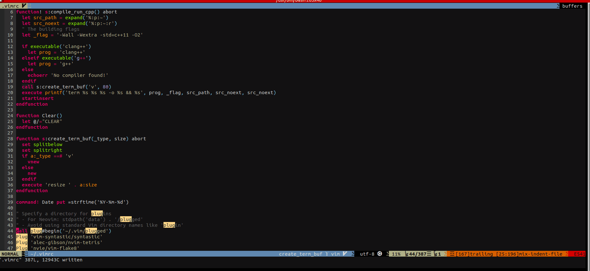

# weather
shows the current weather
```vim
:Weather
```
	
you can also map to the key \w
```vim
nnoremap <leader>w :call Weather()<CR>
```
	
# Dependency
it is dependend upon 'curl' command.Please make sure you hae curl installed.
```vim
sudo apt install curl
```

	
## Installation
Using vim-plug for installation https://github.com/junegunn/vim-plug
```vim
Plug 'rakeshuv/weather.vim'
```

